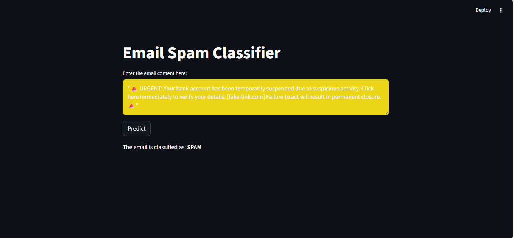

# 📩 Naive Bayes Machine Learning Project

## 📌 Project Overview

This project is a Machine Learning application built using the **Bernoulli Naive Bayes (BNB)** algorithm to classify text data.
It includes text preprocessing, feature extraction, model training, evaluation, and a Streamlit web app for predictions.

---

## 🎯 Problem Statement

The objective of this project is to build a model that can classify text input (such as messages/emails/news) into categories like:

* Spam vs Not Spam
---

## 🧠 Algorithm Used

* Bernoulli Naive Bayes (BNB), 
* (MNB)
* (GNB)
* Natural Language Processing (NLP)
* TF-IDF / Bag-of-Words
* Scikit-learn pipeline

---

## 🗂 Dataset

* Dataset: sms Spam Dataset
* Source: Kaggle
* Features: Text messages
* Target: Spam or Not spam

---

## ⚙️ Tech Stack

* Python
* Pandas
* NumPy
* Scikit-learn
* NLTK
* Streamlit

---

## 🔄 Model Workflow

1. Text cleaning
2. Tokenization (NLTK)
3. Stopword removal
4. Vectorization (TF-IDF / CountVectorizer)
5. Model training (Naive Bayes Algorithm)
6. Model evaluation
7. Dashboard using Streamlit

---


---

## 🚀 How to Run This Project

### Step 1: Clone repository

```bash
git clone https://github.com/your-username/project-name.git
```


### Step 2: Run Streamlit app

```bash
streamlit run app.py
```

---

## 💻 Application

The Streamlit app allows users to:

* Enter text
* Click predict
* View classification result instantly

---

## 📷 Screenshots



## 🔮 Future Improvements

* Use advanced NLP models (LSTM/BERT)
* Improve accuracy
* Deploy online


## ⭐ Support

If you like this project, consider giving it a star ⭐
